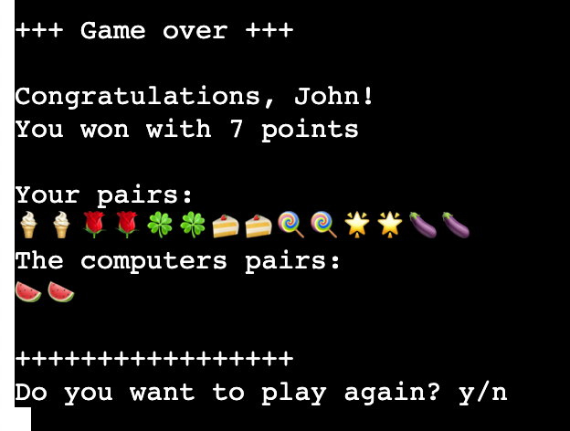

# Python CLI Memory Game

Python CLI Memory Game is a Python command line interface (CLI) application which allows the user to play a well-know game of <a href="https://en.wikipedia.org/wiki/Concentration_(card_game)" target="_blank" rel="noopener">"Concentration"</a>.

This game can be played both by adults and children. In fact, the inspiration for replicating this game for my project came from playing this game with my daughters.

You can play the Python CLI Memory Game here:
[Python CLI Memory Game](https://python-cli-memory-game-ea3c2c01cc65.herokuapp.com/)

[Back to top](#contents)

# Contents

- [User Experience (UX)](#user-experience-ux)
  - [User Stories](#user-stories)
    - [Goals](#goals)
    - [Experience](#experience)
  - [Creation Process](#creation-process)
    - [Planning](#planning)
    - [Dependency diagram](#dependency-diagram)
  - [Design Choices](#design-choices)
- [Input and validation](#input-and-validation)
- [Features](#features)
    - [Game instructions](#game-instructions)
    - [Username input](#user-name-input)
    - [Board of cards](#board-of-cards)
    - [Scores](#scores)
    - [Game over screen](#game-over-screen)
    - [Future Features](#future-features)
- [Technologies Used](#technologies-used)
- [Python Packages](#python-packages)
- [Testing](#testing)
    - [Manual testing](#manual-testing)
    - [External Testing](#external-testing)
- [Deployment to Heroku](#deployment-to-heroku)
  - [Project Deployment](#project-deployment)
  - [To fork the repository on GitHub](#to-fork-the-repository-on-github)
  - [To create a local clone of a project](#to-create-a-local-clone-of-a-project)
- [Credits](#credits)
  - [Content](#content)
  - [Media](#media)
  - [Acknowledgements](#acknowledgements)

[Back to top](#contents)
# User Experience (UX)

## User Stories

### Goals

Provide a simple game for children and adults to help them train their memory skills and have a little fun competing against the computer. Python CLI Memory Game has been designed to be straightforward, with minimalist design due to using CLI. The current version is aimed at people who enjoy a quick brain training or have to kill a few minutes.

### Experience
  - A user can read the title
  - A user can find the game rules after the opening screen.
  - A user can expect a visual feedback for false inputs, scores, game state (board) and results of the match
  - A user can choose to Play again after they have won, or choose to leave the game.

[Back to top](#contents)
## Creation Process
### Planning

Before I started working on the actual application, I created a flow chart (see below) which helped me organize dependencies and provided me with a blueprint to follow when developing the app. 

A challenge was for the content to fit within the restricted size of the window. 
I used the clear_terminal function to keep the CLI neat and easily readable as well as preventing cheating since it is a memory game after all.

Example of requirements taken into account:
  - The game will use simple and clear representation of the board of memory cards.
  - The screen will be cleared periodically, so the user is not overwhelmed or confussed by a large number of print statements.
  - The opponent is gonna be the computer and its turns should be automated but transparent for the player.
  - The game will show the scores at each turn and on the game over screen.
  - The user will have the choice to play again or stop playing the game.
  
[Back to top](#contents)

### Flow Chart

  This is the original flow chart where I broke the program into managable clear steps. 

  

[Back to top](#contents)

## Design Choices

I tried to keep the game design very simple and easily legible. However, I used ASCII art to make the welcome and good-bye screens a bit more interesting.

[Back to top](#contents)

## Input and validation

A significant part of the code is about the validation of user inputs to make sure the program reacts as intended, the intend of the user is clear and the input valid.

### User name
The user name is supposed to start with a letter and may contain letters and numbers, cannot be longer than 20 characters and cannot be "Computer"

### Pick a card
The input for picking a card has to be validated in many different ways:

[Back to top](#contents)

# Features

### Game instructions
After the title is displayed the user will see a brief explanation of how the game works to make sure no questions are unanswered

### User name input
The first user input is the name of the player

### Board of cards

On each turn, the current state of the board is displayed on the screen. Cards that have been removed will not be shown. When a second card is about to be picked, the first card chosen is visible on the board, etc.

### Scores
Scores are displayed above the board on every turn.

[Back to top](#contents)

### Game over screen

After every pair is found on the board the scores are calculated and a winner (or a draw) is announced

### Goodbye message

When the user chooses to quit, a good bye message is displayed.

[Back to top](#contents)
### Future Features
- I would like to let the user choose a difficulty level by giving the choice to increase board size

[Back to top](#contents)

# Technologies Used
- [Github](https://github.com/) - Used for hosting the repository.
- [Heroku](https://heroku.com/) - Used for deploying the application.
- [Gitpod](https://www.gitpod.io/#get-started) - Used for developing the application.
- [Python](https://www.python.org/) - Used for adding functionality to the application.
- [CI Python Linter](https://pep8ci.herokuapp.com/#) - Used for validation python code.
- [Lucidcharts](https://lucid.app) - Used for creating the flow chart
- [Patorjk](https://www.patorjk.com) - Used for creating the ASCII art text

[Back to top](#contents)

# Python Packages

* [OS](https://docs.python.org/3/library/os.html) - Used to clear the screen in the terminal.
* [Time](https://docs.python.org/3/library/time.html) - Used for setting intentional breaks in the flow.
* [Random](https://docs.python.org/3/library/random.html) - Used for shuffling the board of cards.
* [Re](https://docs.python.org/3/library/re.html) - Used for validating username input.
* [Getpass](https://docs.python.org/3/library/getpass.html) - Used to prevent user input from being displayed on the screen.

# Testing

For testing the application, I used manual testing and external validators. External testing are a part of a separate testing [file](/TESTING.md).

### Manual testing
  - I used manual testing throughout the whole development phase of the project. Mainly:
    - I frequently checked if all the inputs were valid, namely if my validation functions were catching all errors and exceptions. 
    - I played the game repeatedly to see if the correct winning message was displaying when the user finished the game.
    - I made sure that when the user chose to play again everything except username gets resetted.
    - I checked if a good-bye message displayed after the user chose not to play again.

### External Testing
  All external testing is a part of a separate testing [file](/TESTING.md).

[Back to top](#contents)

# Deployment to Heroku

## Project Deployment

The application was deployed to Heroku. In order to deploy, the following steps were taken:

1. If you have an account, login to Heroku. Otherwise create a new account.
2. Once signed in, click the button "New" in the top right corner, below the header and choose "Create new app".
3. Choose a unique name for the application and select your region. When done, click "Create app".
4. This brings you to the "Deploy" tab. From here, click the "Settings" tab and scroll down to the "Config Vars" section and click on "Reveal Config Vars". In the KEY input field, enter "PORT" and in the VALUE input field, enter "8000". After that, click the "Add" button on the right.
5. Afterwards, scroll down to the "Buildpacks" section of the settings page and click the button "Add buildpack".
6. First add "Python" package and then "node.js". 
7. If you exchanged the order of the packages, just drag the Python package above.
8. Scroll back to the top of the page and choose the "Deploy" tab. Then choose "GitHub" as Deployment method.
9. Go to "Connect to GiHub" section, search for the repository and then click "Connect".
10. In the "Automatic Deploys" section, choose your preferred method for deployment. At first, I used the manual deployment option, and later I changed it to automatic deploys. Afterwards, click "Deploy Branch".
   
    
The link to the the live site can be found here - https://python-cli-memory-game-ea3c2c01cc65.herokuapp.com/.
The link to the GitHub repository can be found here - https://github.com/CsClown/MemoryGame.

[Back to top](#contents)

## To fork the repository on GitHub

A copy of the GitHub Repository can be made by forking the GitHub account. This copy can be viewed and changed without affecting the original repository. Take the following steps to fork the repository:

1. Log in to **GitHub** and locate the [repository](https://github.com/CsClown/MemoryGame).
2. On the top right hand side of the page is a button called **'Fork'**. Click on the button to create a copy of the original repository in your GitHub Account.

[Back to top](#contents)

# Credits

- credit goes to chatGPT which helped me by explaing basic concepts such as clearing the Terminal or letting the program flow idle with time.sleep
- i used the readme.md from [Lucia Ferencik](https://github.com/lucia2007) as jumping off point for my own documentation

## Acknowledgements
- Extra help and guidance was received from my mentor Precious Ijege.
- I wanna acknowledge myself for having the guts and the perseverance to code the whole thing from scratch without any tutorial or other project to copy from. 

[Back to top](#contents)