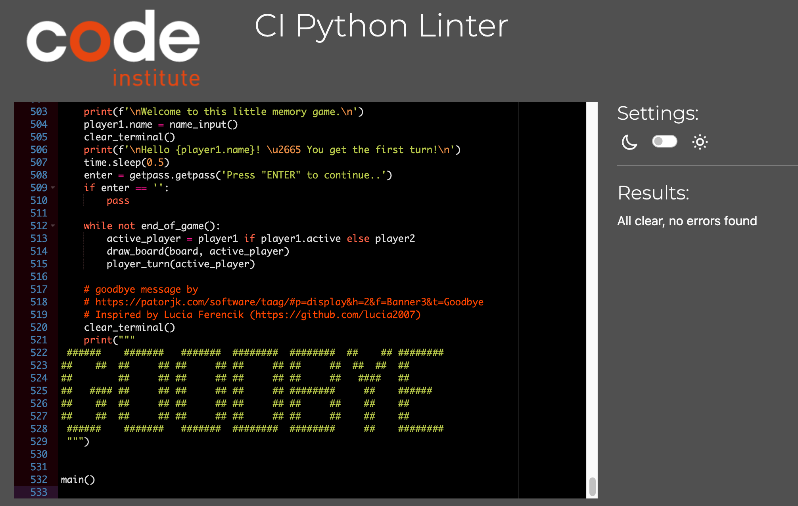
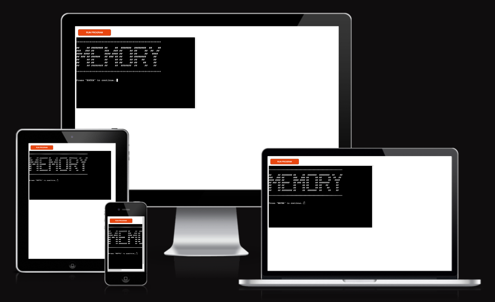
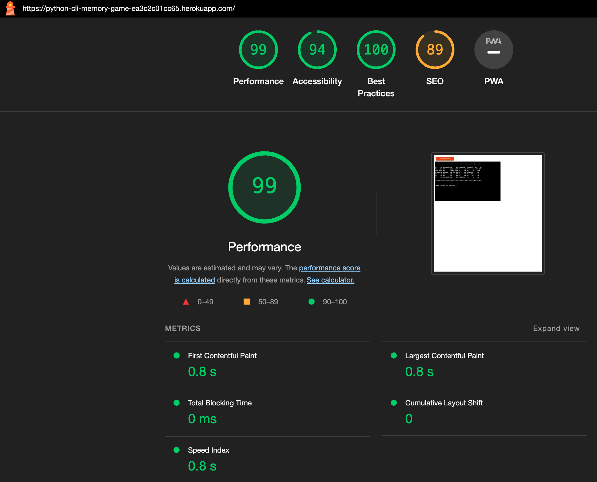

# Testing

## Code Validation

The [Python CLI Memory Game](https://python-cli-memory-game-ea3c2c01cc65.herokuapp.com/) application was thouroughly tested. Python code was reviewed in the [CI Python Linter](https://pep8ci.herokuapp.com/#). After a couple of hours fixing white spaces and lines that were too long the [run.py file](/run.py) has no errors.

Bugs and warnings encountered during the development process will be described below.

## Browser Compatibility

The website was tested on the following browsers: Google Chrome, Microsoft Edge and Mozilla Firefox. Unfortunately Mozilla Firefox cuts the ASCII symbols at two thirds of their width. 

## Responsiveness Test

I did not perform a responsivness test as this CLI application is intended to be used on desktop only. Just for illustration purposes, I am including the [Am I Responsive](https://ui.dev/amiresponsive) Image 

## Bugs

There are no known bugs in the project.

## Additional Testing
### Lighthouse

The application was also tested using [Google Lighthouse](https://developers.google.com/web/tools/lighthouse) in Chrome Developer Tools. The following aspects were tested:

- Performance - reveals how the site performs during loading
- Accessibility - shows if the site if accessible for all users and suggests ways to improve it
- Best Practices - indicates if the site conforms to industry best practices
- SEO - Search Engine Optimisation - shows if the site is optimised for search engine result rankings

### Results from Lighthouse

