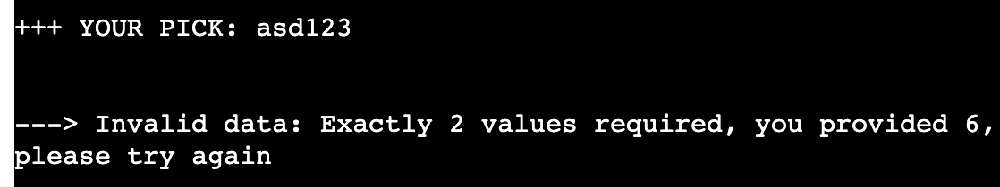
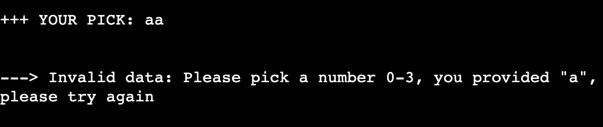

# Testing

## Code Validation

The [Python CLI Memory Game](https://python-cli-memory-game-ea3c2c01cc65.herokuapp.com/) application was thouroughly tested. Python code was reviewed in the [CI Python Linter](https://pep8ci.herokuapp.com/#). After a couple of hours fixing white spaces and lines that were too long the [run.py file](/run.py) has no errors.

Bugs and warnings encountered during the development process will be described below.

## Browser Compatibility

The website was tested on the following browsers: Google Chrome, Microsoft Edge and Mozilla Firefox. Unfortunately Mozilla Firefox cuts the ASCII symbols at two thirds of their width. 

## Responsiveness Test

I did not perform a responsivness test as this CLI application is intended to be used on desktop only. Just for illustration purposes, I am including the [Am I Responsive](https://ui.dev/amiresponsive) Image 

## Input and validation

A significant part of the code is about the validation of user inputs to make sure the program reacts as intended, the intend of the user is clear and the input valid.

### User name
The user name is supposed to start with a letter and may contain letters and numbers, cannot be longer than 20 characters and cannot be "Computer"

### Pick a card
The input for picking a card has to be validated in many different ways:

[Back to top](#contents)

## Bugs

###  - Bug Report: Game Restart Logic

- **Description**:
    - The game board did not reset when the "play again" option was chosen, causing the game to continue with the previous board state.
    
- **Root Cause**:
    - The issue was due to the `board` variable not being properly reset within the `initialize_board()` function. The variable's scope was local to the function, preventing the board from being correctly reinitialized.
    
- **Solution**:
    - The error was resolved by adding the `global` keyword to the `board` variable inside the `initialize_board()` function. This ensured that the board was correctly reset to a new state each time the game was restarted.

### - Bug Report: Pair Discovery

- **Description**:
    - The game failed to recognize pairs when they were found, preventing proper scoring and pair removal.
    
- **Root Cause**:
    - The issue was traced back to an indexing error in the `check_pair()` function. This error caused the function to incorrectly compare the values of the selected cards.
    
- **Solution**:
    - The error was resolved by correcting the indexing within the `check_pair()` function. This ensured that the function accurately compared the values of the selected cards, allowing the game to correctly recognize and handle pairs.

### - Bug Report: Input Validation Logic

- **Description**:
    - When prompted to decide whether to play again, the game consistently threw a `ValueError`, regardless of the user's input.
    
- **Root Cause**:
    - The issue was traced back to a logical error in the condition used for input validation. The use of the `or` operator caused the condition to always evaluate as `True`, leading to the `ValueError` being raised for any input.
    
- **Solution**:
    - The error was resolved by correcting the logical expression. Changing the condition from using `or` to `and` (i.e., `if choice.upper() != 'Y' and choice.upper() != 'N'`) ensured that the `ValueError` was only raised when the input was neither 'Y' nor 'N'. This adjustment allowed the game to correctly process valid inputs and handle invalid ones appropriately.

There are no known unresolved bugs in the project.

## Additional Testing
### Lighthouse

The application was also tested using [Google Lighthouse](https://developers.google.com/web/tools/lighthouse) in Chrome Developer Tools. The following aspects were tested:

- Performance - reveals how the site performs during loading
- Accessibility - shows if the site if accessible for all users and suggests ways to improve it
- Best Practices - indicates if the site conforms to industry best practices
- SEO - Search Engine Optimisation - shows if the site is optimised for search engine result rankings

### Results from Lighthouse

